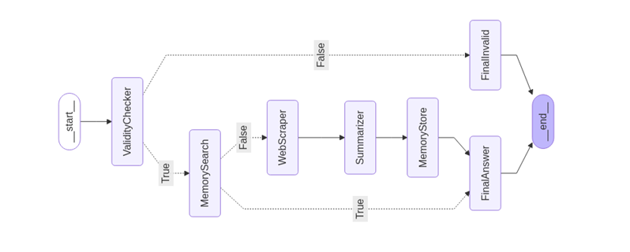

# Multi-Agentic-QnA-system-implemeted-with-LangGraph

This application is a **multi-agent question answering system** built using **LangGraph**, integrating powerful tools such as **Google Search**, **Playwright**, **FAISS vector store**, and **LLMs (via Groq)** to simulate a smart assistant capable of retrieving, analyzing, and summarizing information from the web. Users can input any real-world query, which is validated for search-worthiness, checked against stored memory for similar past responses, and, if needed, researched live using a combination of search APIs and web scraping. The system intelligently summarizes findings and stores new responses to improve efficiency over time. A **Streamlit-based frontend** makes the tool interactive and user-friendly, providing final answers and step-by-step traceability of actions taken by the agent. The entire workflow is trackable with **LangSmith tracing** for better observability and debugging.

## 🔍 Key Features

1. **Query Validation**: Filters out non-search-worthy input automatically.  
2. **Memory-Augmented Retrieval**: Returns stored answers for previously asked similar queries.  
3. **Real-time Web Scraping**: Fetches up-to-date web data via Google Search and Playwright.  
4. **LLM-Powered Summarization**: Condenses web data into human-readable answers.  
5. **Memory Update**: Stores every new query-answer pair for future lookup.  
6. **Agent Orchestration with LangGraph**: Clean, traceable, and branching logic controlled with LangGraph and traced via LangSmith.


## How to Run

### 1. Install Dependencies
Ensure you have Python installed. Create a virtual environment and install the required dependencies:

```bash
pip install -r requirements.txt
```

### 2. Obtain Groq key
Create a **.env** file in the root directory.

```bash
LANGCHAIN_TRACING_V2=true
LANGSMITH_ENDPOINT=https://api.smith.langchain.com
LANGSMITH_API_KEY=lsv2_pt_.................................
LANGSMITH_PROJECT=google-search-agent
GOOGLE_CSE_ID=...................."
GOOGLE_API_KEY = AIzaSy.......................
GROQ_API_KEY=gsk_..............................................................
```
### 3. Lauch the Application
Run the following command to start the application:

```bash
streamlit run app.py
```

## 🛠️ Implementation Approach

This application utilizes a modular, agent-based architecture powered by **LangGraph** to dynamically process user queries. The flow is governed by decision-based branching and sequential task execution, ensuring accurate, traceable, and memory-augmented responses.

### 🧠 Step-by-Step Agent Flow

1. **Start Node**: Query input enters the system.
2. **🧐 ValidityChecker**  
   Checks if the query is meaningful and search-worthy.
   - If **False** → goes to `FinalInvalid`.
   - If **True** → proceeds to memory check.
3. **💾 MemorySearch**  
   Searches for similar queries in the vectorstore.
   - If similar result found → jumps to `FinalAnswer`.
   - If not found → invokes live web scraping.
4. **🌐 WebScraper**  
   Uses `GoogleSearchAPIWrapper` + Playwright to fetch real-time top search results.
5. **📝 Summarizer**  
   Summarizes scraped content using an LLM (Groq or OpenAI).
6. **📦 MemoryStore**  
   Stores the new query-response pair in the vectorstore for future similarity checks.
7. **✅ FinalAnswer**  
   Returns the answer to the user.
8. **❌ FinalInvalid**  
   If the query is not valid, prompts the user to rephrase.


### 📈 LangGraph Flow Diagram




---

## Streamlit Based Interfaces


## LangSmith Tracing of Notes

Tracking Each activity through LangGraph system

---


The side bar showing the nodes visited in Langgraph, in the main body, its showing the input, then its response is "Answer", "Scrapped Pages" contains list of content from top five webpage link searched, "Similar Query" showing false means that similar query were not found in FAISS vector db, "valid" showing true means query is searchable.

---


Here the similar query found in the memory as in the above image case it was stored in memory, so its flow through nodes are different, here scrapping not done, so "scrapped pages" is [.. empty.. ] 

---


This is when asked about japan, it now don't have similar query, so its visit through "scraper" node and have scrapped content after triggering websearch node, therfore the "similar query" is false here.

---


Upons passing the same query, now it reflected answer/response through memory seaching, not triggered the web searching.

---
